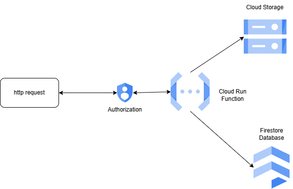

# Serverless News Feed: Building a News Pipeline with Cloud Run Functions

This application fetches news articles from a given website URL.

**Functionality:**

- Downloads a specified number of news articles.
- Parses the articles.
- Stores the parsed data in both Google Cloud Storage and Firestore.
- Deployed as a Google Cloud Run Function triggered by HTTP requests.

**Objective:** This project demonstrates the development and deployment of an HTTP-triggered Cloud Run Function with the necessary privileges to interact with other Google Cloud services.

**While this project utilizes `gcloud` for initial deployment, it adheres to Infrastructure as Code principles by promoting a repeatable and version-controlled deployment process.** This can be further enhanced by migrating to a declarative configuration tool like Terraform.

# Table of Content

- [News Articles Downloader](#news-articles-downloader)
- [Table of Content](#table-of-content)
- [How it Works](#how-it-works)
- [Prerequisites](#prerequisites)
- [Local Environment Setup](#local-environment-setup)
- [Setting Up GCP Resources](#setting-up-gcp-resources)
- [Deploying the Application](#deploying-the-application)
  - [Test as a Command-Line Utility](#test-as-a-command-line-utility)
  - [Test the Cloud Run Funciton locally](#test-the-cloud-run-funciton-locally)
  - [Deploy the application as unauthenticated Cloud Run Function](#deploy-the-application-as-unauthenticated-cloud-run-function)
  - [Deploy an Authenticated Cloud Run Function](#deploy-an-authenticated-cloud-run-function)
- [Deploying a Workflow to Invoke Cloud Run Functions in Parallel](#deploying-a-workflow-to-invoke-cloud-run-functions-in-parallel)
- [Clean the resources](#clean-the-resources)
- [Disclaimer](#disclaimer)

<a id="how-it-works"></a>
# How it Works

This application fetches news articles from specified websites.

1. **Trigger:** The application is triggered by an HTTP request. This request includes:

   - **Website URL:** The URL of the news website you want to fetch articles from.
   - **Number of Articles:** The desired number of articles to download.

2. **Authentication:**

   - The request is authenticated. Only authorized users or services are allowed to trigger the application.

3. **Data Fetching:**

   - The application checks the Firestore database to see if articles from the given URL have already been fetched.
   - It downloads only the specified number of new articles from the website.

4. **Data Processing & Storage:**

   - The application parses the downloaded articles.
   - The parsed data is saved in two locations:
     - **Google Cloud Storage:** Each article is stored as a separate JSON document.
     - **Firestore Database:** Each article is saved as a document within a collection in Firestore.

    

<a id="prerequistes"></a>

# Prerequisites

- **Google Cloud Account:** You'll need an active Google Cloud Platform (GCP) account with a project.
- **GCP Project:** A GCP project to host the application and its resources.
- **IAM Permissions:**
  - You need appropriate IAM (Identity and Access Management) permissions within your GCP project.
  - This typically includes the ability to:
    - Create and delete service accounts.
    - Assign roles to service accounts (e.g., Cloud Storage Object Viewer, Firestore Data Viewer).
- **gcloud CLI:** Install and configure the gcloud command-line interface on your local machine.
- **Python 3.12:** Install Python 3.12 on your local machine.

<a id="setup-local"></a>
# Local Environment Setup

To develop and test this application locally, you'll need Python 3.12 and a few essential libraries.

1. Create a Virtual Environment:

**Recommended:** Create a virtual environment to isolate the project's dependencies from your system's global Python installation.
  - Using venv (built-in with Python):

    ```bash
    python3.12 -m venv <your_env_name> 
    source <your_env_name>/bin/activate  # On Linux/macOS
    <your_env_name>\Scripts\activate.bat  # On Windows
    ```

  - Using conda (if you have Anaconda or Miniconda installed):

    ```bash
    conda create -n <your_env_name> python=3.12 
    conda activate <your_env_name>
    ```
2. Install Requirements:

Once you've activated your virtual environment, install the necessary project dependencies:

```bash
pip install -r requirements.txt

```

<a id="setup-gcp-resources"></a>

# Setting Up GCP Resources

This section guides you through setting up the necessary resources on Google Cloud Platform (GCP) using the `gcloud` CLI for deploying the application.

**Prerequisites:**

* A GCP project with appropriate permissions.
* The `gcloud` CLI installed and configured.

**Steps:**

1. **Configure Environment Variables:**

    * Create or udpate file named `.env` in your project directory.
    * Add the following environment variables to the `.env` file, replacing placeholders with your specific values:

        ```
        PROJECT_ID=your-project-id
        REGION=deployment-region  # e.g., us-central1
        NEWS_BUCKET=unique-bucket-name  # To store downloaded articles as files
        DATABASE_NAME=database-name  # To store article data as collection
        COLLECTION_NAME=collection-name  # Collection to be created within the Firestore database
        SVC_ACCOUNT=service-account-name  # Used by the application
        GOOGLE_APPLICATION_CREDENTIALS=path/to/credentials-file  # Where credentials are stored
        FUNCTION_NAME=function-name-to-deploy
        ```

    * **Note:** Keep the `.env` file secure and avoid committing it to version control.

2. **Source Environment Variables:**

    * In your terminal, run the following command to source the environment variables from the `.env` file:

        ```bash
        source $(pwd)/.env
        ```

3. **Set Current Project:**

    * Use the `gcloud` command to set your GCP project as the active project:

        ```bash
        gcloud config set project $PROJECT_ID
        ```

4. **Enable Required APIs:**

    * Enable the required Google Cloud APIs for the application to function:

        ```bash
        gcloud services enable \
          artifactregistry.googleapis.com \
          cloudfunctions.googleapis.com \
          cloudbuild.googleapis.com \
          eventarc.googleapis.com \
          run.googleapis.com \
          logging.googleapis.com \
          storage.googleapis.com \
          pubsub.googleapis.com
        ```

5. **Create Service Account:**

    * Create a new service account that the application will use to access GCP resources:

        ```bash
        gcloud iam service-accounts create $SVC_ACCOUNT
        export SVC_ACCOUNT_EMAIL=$SVC_ACCOUNT@$PROJECT_ID.iam.gserviceaccount.com
        ```

6. **Download Service Account Key:**

    * Download the JSON key file associated with the service account and store it securely:

        ```bash
        gcloud iam service-accounts keys create $GOOGLE_APPLICATION_CREDENTIALS \
          --iam-account=$SVC_ACCOUNT_EMAIL
        ```

        * Replace `$GOOGLE_APPLICATION_CREDENTIALS` with the desired path where you want to save the key file.

7. **Create Cloud Storage Bucket:**

    * Create a Cloud Storage bucket to store the downloaded news articles:

        ```bash
        gcloud storage buckets create gs://$NEWS_BUCKET \
          --default-storage-class=standard \
          --location=$REGION
        ```

8. **Create Firestore Database:**

    * Create a Firestore database to store the parsed article data as documents within a collection:

        ```bash
        gcloud firestore databases create \
          --database=$DATABASE_NAME \
          --location=$REGION
        ```

9. **Grant Service Account Permissions:**

    * Grant the service account the necessary permissions to access the Cloud Storage bucket and Firestore database:

        * Grant "Storage Object User" role for accessing the Cloud Storage bucket:

            ```bash
            gcloud projects add-iam-policy-binding $PROJECT_ID \
              --member="serviceAccount:$SVC_ACCOUNT_EMAIL" \
              --role="roles/storage.objectUser"
            ```

        * Grant "Firestore User" role for accessing the Firestore database:

            ```bash
            gcloud projects add-iam-policy-binding $PROJECT_ID \
              --member="serviceAccount:$SVC_ACCOUNT_EMAIL" \
              --role="roles/datastore.user"
            ```

# Deploying the Application

This section guides you through deploying the application as a Cloud Run Function on Google Cloud Platform (GCP). It also covers testing the application locally before deployment.

In this section will deploy the application as Cloud Run Function, but before deployment test the application as standalone command line utility, test the cloud run function locally

## Test as a Command-Line Utility

* Execute the application locally using the following command:

```bash
python main.py --newssite website_url --docs_count 5
```

* Expected output:

```
5 articles parsed form url and saved to cloud storage!
```

**Note:** if you get following error ```google.api_core.exceptions.PermissionDenied: 403 Missing or insufficient permissions.``` 
- please check the that above commands providing IAM permissions to the service account were executed properly.
- sometimes it takes few minutes for permissions to be effective, try after few minutes

## Test the Cloud Run Funciton locally

Before deploying the application, you can test the Cloud Run Function locally to ensure it's working as expected.

1. Initiate the Function:

Run the following command to start the Cloud Run function locally:

```bash
functions-framework --target get_website_articles
```

This will initiate the function and make it accessible on your local machine's IP address (usually http://127.0.0.1:8080).

2. Run the Test Script:

The project includes a test script named test_crf.py to simulate invoking the function. Execute the script with the following command, replacing <URL> with the actual local URL where the function is running (likely http://127.0.0.1:8080):

```bash
python test_crf.py --crf_url http://127.0.0.1:8080
```

3. Expected Output:

If the function runs successfully, the test script should produce output similar to:

```bash
b'5 articles parsed form url and saved to cloud storage!'
```

This indicates that the function was able to:

- Fetch articles from the provided URL.
- Parse the articles.
- Save the parsed data to Cloud Storage.

## Deploy the application as unauthenticated Cloud Run Function

This section guides you through deploying the application as an unauthenticated Cloud Run function on Google Cloud Platform (GCP). Unauthenticated functions can be invoked by anyone without requiring any credentials.

1. Before deployment there is need to provide some additional permissions to the service principal
Here's the improved documentation for the README file in markdown format:

Deploying an Unauthenticated Cloud Run Function
This section guides you through deploying the application as an unauthenticated Cloud Run Function on Google Cloud Platform (GCP). Unauthenticated functions can be invoked by anyone without requiring any credentials.

Prerequisites:

Complete the GCP resource setup steps (refer to the previous section for instructions).
Ensure the service account has the necessary IAM roles (listed in the steps below).
1. **Grant Additional Permissions:**

Before deployment, grant the service account additional permissions to interact with GCP services used by the function:

- **Cloud Build Editor:** Allows the service account to deploy the function itself.
- **Logs Viewer:** Allows the service account to view logs generated by the function.
- **IAM Service Account User:** Allows the service account to impersonate itself (needed for some GCP APIs).
- **Cloud Run Admin:** Allows the service account to manage Cloud Run Functions.
0 **Cloud Functions Admin:** Allows the service account to manage Cloud Functions (includes Cloud Run).

```bash
gcloud projects add-iam-policy-binding $PROJECT_ID \
  --member="serviceAccount:$SVC_ACCOUNT_EMAIL" \
  --role="roles/cloudbuild.builds.editor"

gcloud projects add-iam-policy-binding $PROJECT_ID \
  --member="serviceAccount:$SVC_ACCOUNT_EMAIL" \
  --role="roles/logging.viewer"

gcloud iam service-accounts add-iam-policy-binding $SVC_ACCOUNT_EMAIL \
  --member="serviceAccount:$SVC_ACCOUNT_EMAIL" \
  --role="roles/iam.serviceAccountUser"

gcloud projects add-iam-policy-binding $PROJECT_ID \
  --member="serviceAccount:$SVC_ACCOUNT_EMAIL" \
  --role=roles/run.admin

gcloud projects add-iam-policy-binding $PROJECT_ID \
  --member="serviceAccount:$SVC_ACCOUNT_EMAIL" \
  --role=roles/cloudfunctions.admin
```

2. **Create Environment Variables File:**

Create a file named .env.yaml in your project root directory. This file will store environment variables used by the Cloud Run Function at runtime to access GCP resources. Add the following lines to the file, replacing placeholders with your values:

```
NEWS_BUCKET: your-storage-bucket-name  # Name of the Cloud Storage bucket to store articles
DATABASE_NAME: your-firestore-database-name  # Name of the Firestore database
COLLECTION_NAME: your-collection-name  # Name of the collection within the Firestore database to store articles
```

3. **Deploy the Cloud Run Function:**

Deploy the Cloud Run Function using the gcloud command. Replace placeholders with your values:

```bash
gcloud functions deploy $FUNCTION_NAME \
	--gen2     \
	--runtime=python312     \
	--run-service-account=$SVC_ACCOUNT_EMAIL \
	--region=$REGION     \
	--source=.     \
	--entry-point=get_website_articles     \
	--trigger-http     \
  	--max-instances 2 \
	--allow-unauthenticated \
	--env-vars-file .env.yaml \
	--memory=1024Mi

```

- --gen2: Specifies the Cloud Run generation (2nd generation).
- --runtime: Sets the runtime environment (Python 312).
- --run-service-account: Specifies the service account used by the function.
- --region: Deploys the function to a specific region.
- --source: Sets the source code directory (current directory).
- --entry-point: Defines the function to be invoked (get_website_articles).
- --trigger-http: Creates an HTTP trigger for the function.
- --max-instances: Sets the maximum number of function instances to run concurrently (scales automatically).
- --allow-unauthenticated: Allows anyone to invoke the function without authentication.
- --env-vars-file: Specifies the file containing environment variables.
- --memory: Sets the memory allocation for the function instance (1024 MiB).

4. **Get the Function URL:**

After deployment, retrieve the URL of the deployed function:

```bash
FUNCTION_URI=$(gcloud functions describe $FUNCTION_NAME --gen2 --region $REGION --format "value(serviceConfig.uri)")
echo $FUNCTION_URI
```

5. Run the Test Script:

Execute the test script by replacing <URL> with the actual URL of the function deployed in pervious step

```bash
python test_crf.py --crf_url $FUNCTION_URI
```

Expected Output:

If the function runs successfully, the test script should produce output similar to:

```
b'5 articles parsed form url and saved to cloud storage!'
```

## Deploy an Authenticated Cloud Run Function

This section guides you through deploying the application as an authenticated Cloud Run Function on GCP. Authenticated functions require authorization to be invoked. Only users or service accounts with the appropriate IAM roles can call the function.

1. **Deploy the Cloud Run Function:**

Deploy the Cloud Run function with authentication enabled. The main difference from the unauthenticated deployment is the --no-allow-unauthenticated flag:

```bash
gcloud functions deploy $FUNCTION_NAME \
	--gen2     \
	--runtime=python312     \
	--run-service-account=$SVC_ACCOUNT_EMAIL \
	--region=$REGION     \
	--source=.     \
	--entry-point=get_website_articles     \
	--trigger-http     \
  	--max-instances 2 \
	--no-allow-unauthenticated \
	--env-vars-file .env.yaml \
	--memory=1024Mi

```

2. **Get the Function URL:**

After deployment, retrieve the URL of the deployed function:

```bash
FUNCTION_URI=$(gcloud functions describe $FUNCTION_NAME --gen2 --region $REGION --format "value(serviceConfig.uri)")
echo $FUNCTION_URI
```

3. Execute the test script by replacing <URL> with the actual URL of the function deployed in pervious step

```bash
python test_crf.py --crf_url $FUNCTION_URI
```

Expected error from the above execution is
```
Failed to retrieve the page. Status code: 403
```

4. Create a Service Account for Invocation (Important):

Since the function is now authenticated, attempting to invoke it with the test script from the previous section will fail due to missing authorization. You'll need to create a separate service account with the "Roles/RunInvoker" role to call the function.

- Update the environment variables to store the name and credentials path of the invoker service account.
```
export SVC_INVOKER_ACCOUNT=replace-with-the-name-of-the-service-principal
export SVC_INVOKER_ACCOUNT_EMAIL=$SVC_INVOKER_ACCOUNT@$PROJECT_ID.iam.gserviceaccount.com
export SVC_INVOKDER_KEY_FILE=path-to-save-the-credentials
```

- Create a new service account:
```
gcloud iam service-accounts create $SVC_INVOKER_ACCOUNT
```

- Grant the "Roles/RunInvoker" role to the new service account, allowing it to invoke Cloud Run Functions:
```
gcloud functions add-invoker-policy-binding $FUNCTION_NAME \
  --member=serviceAccount:$SVC_INVOKER_ACCOUNT_EMAIL
```

- Download the service account credentials to a local file:
```
gcloud iam service-accounts keys create $SVC_INVOKDER_KEY_FILE \
    --iam-account=$SVC_INVOKER_ACCOUNT_EMAIL
```

5. **Test the Function with Authentication:**

Now that you have a service account authorized to invoke the function, update the test script to include the authentication credentials:

- --key_file: Path to the downloaded service account credentials file.
```
python test_crf.py --crf_url $FUNCTION_URI --key_file $SVC_INVOKDER_KEY_FILE
```

If the function is deployed and configured correctly, running the test script with authentication should now produce the expected output:

```
b'5 articles parsed form url and saved to cloud storage!'
```

# Deploying a Workflow to Invoke Cloud Run Functions in Parallel

This section demonstrates how to create a GCP workflow that can invoke multiple Cloud Run Functions parallelly. This workflow will be configured to call two Cloud Run Functions simultaneously to download articles from separate websites.

1. **Create the Workflow YAML File:**

Create a file named workflow.yaml and add the following YAML configuration:

```
main:
  steps:
    - extractArticles:  # Name of the workflow step
        parallel:          # Specifies parallel execution of branches
          branches:         # List of branches to execute in parallel
            - getBranch0:    # Name of the first branch
                steps:          # Steps to be executed within this branch
                  - extractArticlesStep0:  # Name of the step within the branch
                      call: http.post      # Action to be performed (HTTP POST)
                      args:
                        url: replace-with-function-rul  # URL of the first Cloud Run function
                        auth:                # Authentication configuration
                          type: OIDC          # Authentication type (OpenID Connect)
                        body:                 # Request body for the HTTP POST call
                          newssite: website_url1 # Parameter for the first function (news website URL)
                          docs_count: '10'        # Parameter for the first function (number of documents to download)
                      result: Articles0     # Name to store the result of the step execution

            - getBranch1:    # Name of the second branch (similar structure to the first branch)
                steps:
                  - extractArticlesStep1:
                      call: http.post
                      args:
                        url: replace-with-function-rul
                        auth:
                          type: OIDC
                        body:
                          newssite: website_url2
                          docs_count: '10'
                        result: Articles1
```

2. **Deploy the Workflow:**

Once you've created the workflow.yaml file, you can deploy the workflow to GCP using tools like gcloud. The specific deployment process might vary depending on your chosen workflow orchestration tool.

```
export NEWS_DOWNLOAD_WORKFLOW=replace-with-the-name-of-the-workflow # e.g. news-downloader-workflow

gcloud workflows deploy $NEWS_DOWNLOAD_WORKFLOW \
    --source=workflow.yaml \
    --service-account=$SVC_INVOKER_ACCOUNT_EMAIL
```

3. **Test the workflow by running it**

```
gcloud wokflows run $NEWS_DOWNLOAD_WORKFLOW
```

# Clean the resources

Certainly, here's how you can clean up GCP resources to avoid further costs:

1. Delete the Cloud Run Function:


```
gcloud functions delete $FUNCTION_NAME --region=$REGION --quiet
```

2. Delete the Workflow:

If using Workflows:

```
gcloud workflows delete $WORKFLOW_NAME --location=$REGION --quiet
```

Replace $WORKFLOW_NAME with the actual name of your workflow.


3. Delete the Service Accounts:

```
gcloud iam service-accounts delete $SVC_ACCOUNT --quiet
gcloud iam service-accounts delete $SVC_INVOKER_ACCOUNT --quiet
```

4. Delete the Cloud Storage Bucket:

```
gcloud storage buckets delete gs://$NEWS_BUCKET --quiet
```

5. Delete the Firestore Database:

```
gcloud firestore databases delete $DATABASE_NAME --quiet
```
Important Notes:

- --quiet flag: This flag suppresses the output from the gcloud commands, making the deletion process cleaner and less verbose.
- Double-check: Before running any deletion command, carefully review the resource names to ensure you are deleting the correct resources.
- Consider a Cleanup Script: For more efficient cleanup, create a Python script that includes these commands and sample scripts are avaialble in repository
  
By following these steps, you can effectively clean up the deployed resources and prevent any further costs associated with them.


# Disclaimer

This project is for educational and learning purposes only.

**Disclaimer:** This project demonstrates the development and deployment of a Cloud Run function.
It attempts to download articles from websites.
- Downloading and processing content from websites without proper authorization or respecting website terms of service may be illegal or unethical.
- This project should not be used for any commercial or production purposes without careful consideration of legal and ethical implications.
- Always respect website terms of service and obtain necessary permissions before scraping or downloading content from any website.

This disclaimer does not constitute legal advice. You are responsible for ensuring that your use of this project complies with all applicable laws and regulations.
